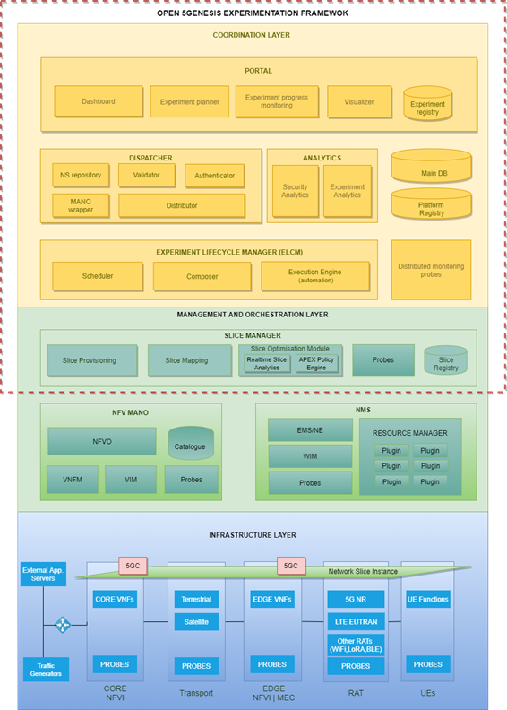

## Overview

The 5GENESIS architecture is structured in three main blocks: Coordination Layer, Management and Orchestration (MANO) Layer and Infrastructure Layer.

Following a top-down description of the 5GENESIS architecture, we start with the Coordination layer. This layer offers all the components of the 5GENESIS experimentation framework relevant to experiments, as well as the experiment facing Application Programming Interfaces (APIs) and User Interfaces (UIs). In detail the Coordination Layer provides Northbound Interfaces (NBI) for the Experimenter, the 5GENESIS Portal and the Open APIs. Via the Portal, the Experimenter can be authenticated, on-board vertical application components, submit experiment requests and, after the execution of the experiment, acquire measurements (either raw or processed). During the experimentation, the Experiment Lifecycle Manager (ELCM) is responsible for the experiment lifecycle stages sequencing, by maintaining the experiment status and providing feedbacks.

The analytics component of the Coordination Layer is responsible for the complete collection and analysis of the heterogeneous monitoring data produced during the usage of the 5GENESIS experimentation. In order to collect the monitoring information from all the elements of each 5GENESIS platform, the analytics component retrieves the measurements from the probes deployed in each platform. This component ingests either in-real time or after the end of each experiment session, the measurements in a unified database for post-processing and long term storage. To this end, the monitoring framework also collects and stores information from the testing probes that are exploited during the experiment.

In light of state-of-the-art network monitoring and analytics functionalities, the 5GENESIS Monitor and Analytics (M&A) framework positions itself as a key enabler for a complete validation of 5G KPIs.

In the Management and Orchestration Layer, the Slice Manager is in charge of the configuration and deployment of the slices. This also implies the access to the components available at the Infrastructure Layer.

## Main features

The Open5GENESIS Coordination Layer provides the baseline functionalities that allows the experimentation in the different 5Genesis platforms.

Release A provided initial support for the execution of Tests Cases and the collection of results, while Release B implements the whole automation cycle and additional features that enhance the experimentation capabilities and KPI validations for the vertical Experimenters. In a nutshell, the prominent features available after the installation of the Release B codebase are:

### Portal
  - User registration
  - Experiment creation and execution
  - Experiment logs and raw results visualization
  - Access to the Analytics Dashboard
  - Network Service onboarding interface
  - Support for the execution of distributed experiments

### Dispatcher
 - User management and access control
 - MANO Enabler:
    - Validation of VNFDs and NSDs
    - VIM image uploading
    - VNFD and NSD listing and updating
    - Artifacts repository integrated with ETSI OSM
 - Experiment validation

### ELCM
 - Experiment execution, access to runtime status
 - Automatic handling and storage of execution logs
 - Orchestration of external components:
    - Integration of the OpenTAP framework
    - Support for generic script execution
    - Ready to use Tasks for common integrations
    - Extensible via plugins for various infrastructure elements and components
 - Testbed resources management
 - Integration with the Katana Slice Manager:
    - Automatic deployment/decommision of Network Services during experiment
 - Support for the execution of distributed experiments

### Monitoring and Analytics
 - Analytics Dashboard:
    - Data visualization
    - Prediction
    - Correlation
    - Feature selection
    - Statistical analysis
 - Statistical processing and report on selected KPIs

### Slice Manager
- Start/Stop/Inspect end-to-end network slices
- Open APIs supported by swagger-io tool
- Lightweight web user interface
- Integrated Command-Line Interface (CLI) tool
- Modular architecture supporting different infrastructure technologies
- Slice deployment and configuration time measurement
- Prometheus Node exporter
- Message Broker
- Slice Optimization Module

### NMS
- WAN Infrastructure Manager (WIM)
- Software Defined Network (SDN) Control
- Monitoring
- TAP plugins for controlling Android devices and computers through Secure Shell (SSH)
- Performance monitoring tools for Android: resource usage, latency and throughput probes
- Remotely controlled latency and throughput probes for Personal Computer (PC)

## A high-level overview of the 5GENESIS Components

### Release B

* [Portal](https://github.com/5genesis/Portal/tree/release_B)
* [Dispatcher](https://github.com/5genesis/Dispatcher/tree/release_B)
* [ELCM](https://github.com/5genesis/ELCM/tree/release_B)
* [TAP Plugins](https://github.com/5genesis/TAP-plugins/tree/release_B)
* [Slice Manager](https://github.com/5genesis/katana-slice_manager/tree/Release_B)
* [Analytics Module](https://github.com/5genesis/Analytics/tree/Release-B)
* Probes
  * [Monroe VN and Agent](https://github.com/5genesis/monroe-experiment-core/tree/ReleaseA)
      * [Monroe Experiments/probes](https://github.com/5genesis/monroe-experiments/ReleaseB)
  * [Remote Ping agent](https://github.com/5genesis/Remote_Ping_Agent/tree/Release_B)
  * [Remote iPerf agent](https://github.com/5genesis/Remote_iPerf_Agent/tree/Release_B)
  * [Adb TAP plugin](https://gitlab.com/OpenTAP/Plugins/university-of-malaga/uma-android/-/tree/5genesis/release_b)
  * [Android agents TAP plugin](https://gitlab.com/OpenTAP/Plugins/university-of-malaga/uma-adb-agents/-/tree/5genesis/release_b)

### Release A

* [Portal](https://github.com/5genesis/Portal/tree/release_A)
* [ELCM](https://github.com/5genesis/ELCM/tree/release_A)
* [TAP Plugins](https://github.com/5genesis/TAP-plugins/tree/release_A)
* [Slice Manager](https://github.com/5genesis/katana-slice_manager/tree/Release_A)
* Analytics
  * [Statistical Analysis](https://github.com/5genesis/Analytics/tree/Release-A)
  * [Machine Learning Analysis](https://gitlab.fokus.fraunhofer.de/5genesis/analytics/tree/Release-A)
* Probes
  * [Monroe VN and Agent](https://github.com/5genesis/monroe-experiment-core/tree/ReleaseA)
      * [Monroe Experiments/probes](https://github.com/5genesis/monroe-experiments)
  * [Remote Ping agent](https://github.com/5genesis/Remote_Ping_Agent/tree/Release_A)
  * [Remote iPerf agent](https://github.com/5genesis/Remote_iPerf_Agent/tree/Release_A)
  * [Adb TAP plugin](https://gitlab.com/OpenTAP/Plugins/university-of-malaga/uma-android/-/tree/5genesis/release_a)
  * [Android agents TAP plugin](https://gitlab.com/OpenTAP/Plugins/university-of-malaga/uma-adb-agents/-/tree/5genesis/release_a)
